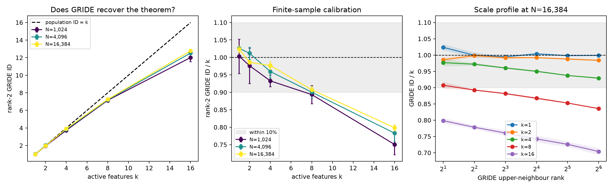

# When can intrinsic dimension count active features?

This project asks whether the intrinsic dimension (ID) of a representation can tell us how many features are active at the same time. The goal is a small proof of concept, not a claim about language models.

The project has two parts:

1. **Analytical baseline:** give simple assumptions under which population local ID is exactly the active-feature count `k`, and check whether GRIDE can measure that fact with finite data.
2. **Structured experiment:** keep the generator simple, but add feature co-occurrence, dependent amplitudes, and structured feature geometry. We will then ask whether GRIDE follows raw `k`, a smaller number of independent degrees of freedom, or neither.

Part 1 is completed below. Part 2 is intentionally left at the level of motivation until Part 1 is understood and trusted.

## Why this question needs two parts

There are two different quantities:

- `k` counts nonzero coordinates in a chosen feature dictionary.
- ID counts how many independent continuous directions the observed data occupy locally.

These quantities *can* be equal, but they need not be. If `k` active amplitudes vary independently and are mapped injectively into the representation, then there are exactly `k` continuous degrees of freedom. In that case, ID equals `k` almost by construction. If the amplitudes are dependent, the feature directions are redundant, noise fills the ambient space, or the estimator uses neighborhoods that mix different structures, the equality can fail.

This distinction gives the two parts different jobs. Part 1 establishes the clean mathematical baseline. Part 2 will ask whether anything resembling that baseline survives in a more structured model with properties motivated by language-model representations.

## Part 1: the minimal sparse-feature model

There are `m` possible features represented by the columns of

\[
W\in\mathbb{R}^{D\times m}.
\]

For one example, let `S` be the set of active features, with \(|S|=k\). Only the active amplitudes matter, so write them as

\[
a=(a_1,\ldots,a_k)\in\mathbb{R}^k.
\]

The representation is

\[
h=W_Sa,
\]

where \(W_S\in\mathbb{R}^{D\times k}\) contains the active feature directions. In the experiment, amplitudes are sampled independently and uniformly from \([0.5,1.5]\).

The important point is that `m` counts all available features, whereas `k` counts the continuous amplitudes that can vary in this particular example.

## What “intrinsic dimension” means here

Choose a typical representation \(h_0\). Let \(B(h_0,r)\) be a ball of radius `r` around it. If the probability of landing in that ball behaves as

\[
\Pr\big[h\in B(h_0,r)\big]\approx C r^d
\]

for small `r`, then `d` is the local intrinsic dimension. Equivalently,

\[
d_{\mathrm{ID}}(h_0)
=\lim_{r\to0}
\frac{\log \Pr[h\in B(h_0,r)]}{\log r},
\]

when this limit exists.

This is intuitive in familiar cases. The length inside a small interval scales like \(r\), the area inside a small disk scales like \(r^2\), and the volume inside a small three-dimensional ball scales like \(r^3\). ID is the exponent of this local scaling law.

GRIDE estimates this exponent from ratios between nearest-neighbour distances. It therefore measures a finite-scale approximation to the population quantity above; it does not make the population theorem true.

## Proposition: under simple conditions, local ID equals `k`

Fix a support `S` containing exactly `k` features. Assume:

1. the active amplitude distribution has a continuous, nonzero density near the point being measured;
2. the active amplitudes can vary in all `k` coordinate directions;
3. \(W_S\) has rank `k`, so none of the active feature directions is redundant;
4. \(k\le D\); and
5. no additional full-dimensional noise is added to `h`.

Then, at almost every point generated from this support,

\[
\boxed{d_{\mathrm{ID}}(h\mid S)=k.}
\]

### Proof

Because \(W_S\) has rank `k`, its smallest and largest singular values satisfy

\[
0<\sigma_{\min}\le \sigma_{\max}<\infty.
\]

For any small change \(\Delta a\) in the active amplitudes,

\[
\sigma_{\min}\lVert\Delta a\rVert
\le
\lVert W_S\Delta a\rVert
\le
\sigma_{\max}\lVert\Delta a\rVert.
\]

This says that the linear map may stretch some directions more than others, but it cannot remove an active-amplitude direction or create a new one.

Let \(h_0=W_Sa_0\). The inequalities imply

\[
B\!\left(a_0,\frac{r}{\sigma_{\max}}\right)
\subseteq
\{a:W_Sa\in B(h_0,r)\}
\subseteq
B\!\left(a_0,\frac{r}{\sigma_{\min}}\right).
\]

A `k`-dimensional ball of radius `r` has volume proportional to \(r^k\). Because the amplitude density is finite and nonzero near \(a_0\), the probability of each bounding ball is also proportional to \(r^k\). Therefore there are positive constants \(c_1,c_2\) such that, for sufficiently small `r`,

\[
c_1r^k
\le
\Pr[h\in B(h_0,r)\mid S]
\le
c_2r^k.
\]

Both bounds have exponent `k`. Taking the small-radius logarithmic limit gives

\[
d_{\mathrm{ID}}(h\mid S)=k.
\]

That is the complete argument. Geometrically, the amplitude vector fills a `k`-dimensional region, and a full-rank linear map bends none of those dimensions away. It only stretches and rotates the region. ∎

### What this proves—and what it does not

For a random continuous dictionary and \(k\le D\), \(W_S\) has rank `k` with probability one. Orthogonal features are not required. An overcomplete dictionary with \(m>D\) is also allowed because only the `k` active columns need to be independent.

If we repeat the model for several fixed values of `k`, the population relationship is exactly \(d_{\mathrm{ID}}(k)=k\). A high correlation across those datasets is consequently expected and is not, by itself, an empirical discovery.

The result concerns population local dimension. It does not say that a finite-sample estimator must return `k`, and it does not say that raw feature count is a representation-independent quantity.

## Three simple ways the equality can fail

### 1. Active does not mean independently varying

Suppose ten features are active but every amplitude is controlled by the same scalar `t`:

\[
a_i=f_i(t).
\]

The representation traces a one-dimensional curve even though `k=10`. Its local ID is at most one. The proposition requires `k` independent local amplitude directions, not merely `k` nonzero numbers.

### 2. The feature count is not uniquely defined

Duplicate every feature direction and split its amplitude equally between the two copies. The representation `h` is unchanged, but the reported active-feature count doubles. ID cannot distinguish these two descriptions because the observed geometry is identical.

This is especially important when features come from a learned dictionary: `k` depends on the dictionary, sparsity penalty, and activation threshold. A meaningful comparison therefore requires a fixed, reasonably nonredundant feature definition.

### 3. Population locality is not finite-sample locality

Even when population ID is exactly `k`, nearest neighbours may be too far away to see the local `k`-dimensional geometry. Boundaries, anisotropy, insufficient samples, and neighborhoods crossing different supports can all bias GRIDE. These are estimator and sampling problems, not counterexamples to the proposition.

## GRIDE validation of Part 1

The validation asks a narrower question than the proof:

> With one fixed support and the sample sizes available to us, how accurately does GRIDE recover the known population value `k`?

The experiment uses:

- representation dimension `D=32`;
- `m=256` isotropic unit-norm feature directions;
- one fixed support per `(k, repeat)` condition, so `B=1`;
- `k={1,2,4,8,16}`;
- `N={1,024,4,096,16,384}` samples from that support;
- independent amplitudes uniform on `[0.5,1.5]`;
- five independently generated dictionaries and supports;
- GRIDE upper-neighbour ranks `2,4,8,16,32,64`.

Within a repeat, every `k` condition uses the same dictionary, and increasing `N` extends the same amplitude stream. Rank 2 is the most local saved estimate; the other ranks check whether the conclusion changes with measurement scale.

The exact run is reproducible with:

```bash
sbatch scripts/run_part1_gride.sh
```

Slurm job `169169` completed all 75 measurements. The raw artifacts are in [`results/part1-fixed-support-169169/`](../results/part1-fixed-support-169169/). All 25 reconstructed active matrices \(W_S\) were full rank. Across them, the smallest singular value was `0.262` and the largest condition number was `6.28`, so the rank assumption held although the larger supports were moderately anisotropic.



The left panel compares the most local saved GRIDE estimate with the analytical target. The middle panel divides the estimate by `k`, making calibration error easier to see. Error bars are approximate 95% intervals across the five repeats. The right panel retains the full GRIDE scale profile at the largest sample count.

At `N=16,384`, the rank-2 results were:

| `k` | mean GRIDE ID | GRIDE ID / `k` | approximate 95% interval half-width |
| ---: | ---: | ---: | ---: |
| 1 | 1.024 | 1.024 | 0.010 |
| 2 | 1.971 | 0.986 | 0.014 |
| 4 | 3.907 | 0.977 | 0.045 |
| 8 | 7.258 | 0.907 | 0.083 |
| 16 | 12.775 | 0.798 | 0.129 |

There are three simple findings.

1. **GRIDE recovers the known dimension well at small and moderate `k`.** At the largest `N`, rank-2 estimates are within 3% for `k<=4` and within 10% for `k=8`.
2. **Increasing `N` helps, but slowly at high dimension.** For `k=16`, the mean estimate rises from `12.009` at `N=1,024` to only `12.775` at `N=16,384`. The relative error remains 20.2%.
3. **Larger neighborhoods make the high-dimensional bias worse.** At `N=16,384`, the estimate for `k=16` falls from `0.798k` at rank 2 to `0.704k` at rank 64. For `k=8`, it falls from `0.907k` to `0.836k`. In contrast, the profiles for `k=1` and `k=2` remain close to the target.

The likely reason is finite locality. The amplitude distribution is a bounded `k`-dimensional box. A rough nearest-neighbour length scale decreases as \(N^{-1/k}\). When `k=16`, even multiplying `N` by 16 reduces this scale by only \(16^{-1/16}\approx0.84\). Neighbors therefore remain far enough away to feel the box boundary and the anisotropy of \(W_S\). GRIDE sees a finite-scale volume-growth exponent below the infinitesimal population value.

This is a measurement limitation, not a contradiction of the proof. The proof concerns the limit as radius goes to zero; the experiment shows that reaching that limit becomes sample-intensive as `k` grows.

### Numerical warning found in the run

DADApy warned about very small neighbour distances in the one-dimensional conditions. Direct reconstruction confirmed that the generated amplitudes were unique. The issue is numerical: at large `N`, some separations along a one-dimensional line approach the resolution of the distance computation. Every GRIDE ID estimate remained finite, but DADApy's internal `gride_error` was `NaN` for five of the 450 profile rows, all at rank 2 with `k=1`. The figure and table therefore use variation across the five independent repeats rather than those internal error estimates.

The generic `support-pool` report also gives an overall `NOT ESTABLISHED` because it expects at least one pooled `B>1` condition. That criterion is intentionally inapplicable here: this validation contains only `B=1`. Its fixed-support criterion itself passed. Using a stricter 10% descriptive threshold, the fresh result supports rank-2 recovery through `k=8`, but not `k=16`.

For Part 2, the conservative estimator-calibrated regime is `k<=4` if we want stability over the entire saved rank profile. `k=8` can be retained as a useful edge condition, but its conclusion must be explicitly local to rank 2. `k=16` should remain a stress test rather than a calibrated scientific condition unless sample density or the estimator protocol is improved.

## Part 1 conclusion

The analytical conclusion does not depend on GRIDE:

> With `k` locally independent amplitudes and a rank-`k` active dictionary, population local ID is exactly `k`.

The numerical conclusion must be stated separately: GRIDE recovers that target only when its finite neighborhoods are sufficiently local and well sampled. The experiment above tells us where that measurement claim is reliable in this particular setup.

This gives Part 2 a precise question. Once supports, amplitudes, and feature directions become structured, does measured ID continue to follow raw `k`, or does it instead follow the smaller number of independently varying feature degrees of freedom? We will design that model only after using the Part 1 diagnostics to choose a defensible GRIDE scale and sample-density regime.
