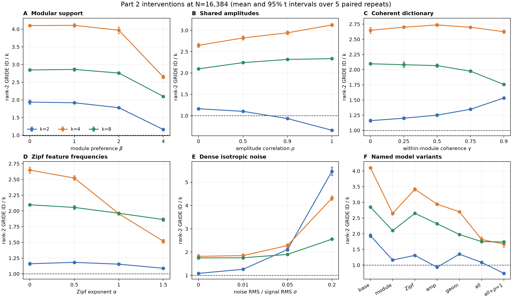
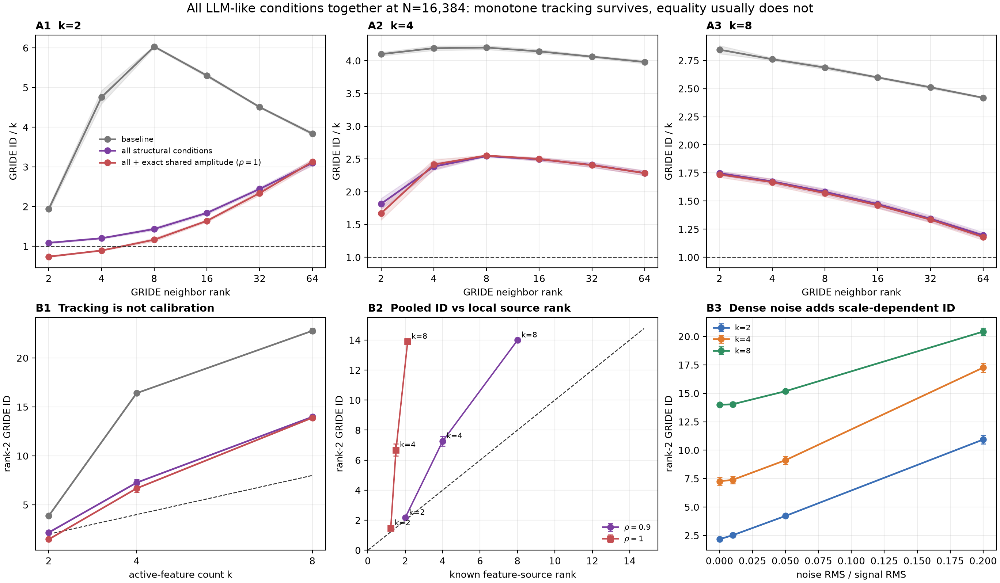

# Part 2 results: structured features preserve tracking, not equality

## Short answer

The experiment gives a useful but qualified result:

> In this toy model, making the representation more structured and more LLM-like preserves a very strong ordering of GRIDE ID by the active-feature count `k`, and it substantially lowers GRIDE ID relative to the unstructured baseline. It does **not** make GRIDE ID generally equal to `k`.

The reason is now visible. GRIDE is not seeing only the continuous amplitudes on one fixed support. At the sampled neighborhood scale it can also see changes between many different supports, ill-conditioned feature geometry, unequal feature frequencies, and dense noise. These contributions all depend on `k`, so ID can track `k` extremely well while not measuring `k` itself.

This is a proof of concept in an untrained generator, not evidence about a real LLM. It is nevertheless a worthwhile result because it separates two claims that are easy to confuse:

1. **Tracking:** larger `k` tends to give larger measured ID.
2. **Calibration:** measured ID is numerically close to `k`.

The first holds very strongly here. The second usually fails.

## What was run

Slurm array `169194` completed all six predeclared suites from [the Part 2 design](06-part2-structured-model.md):

- 840 complete GRIDE measurements;
- 5,040 saved estimates across neighborhood ranks `2,4,8,16,32,64`;
- `D=32`, `m=256`, eight feature modules;
- `k={2,4,8}` and nested sample counts `N={4,096,16,384}`;
- five paired random repeats;
- no missing, non-finite, or failed result cell.

The analysis script is [`scripts/analyze_part2.py`](../scripts/analyze_part2.py). It writes:

- `paired_effects.csv`: every condition contrast at fixed `k`, `N`, GRIDE rank, and repeat;
- `sample_size_effects.csv`: paired changes between the two nested sample counts;
- `tracking_diagnostics.csv`: monotonicity and calibration kept separate;
- `cell_means.csv` and `combined_diagnostics.csv`: means and 95% t intervals over repeats.

The t intervals are descriptive uncertainty over five synthetic repeats. They are useful for checking sign consistency, not a claim of population-level inference or a correction for testing many cells.

## How the paired analysis works

For one intervention, let

\[
\Delta_r(k,N,q)
=
\widehat d_{\mathrm{GRIDE},r}^{\mathrm{intervention}}(k,N,q)
-
\widehat d_{\mathrm{GRIDE},r}^{\mathrm{reference}}(k,N,q),
\]

where `r` is the repeat and `q` is the GRIDE neighbor rank. Both sides use the same random realization. We average the five matched differences and form a 95% t interval from those differences.

This matters because it asks the clean question: after holding `k`, sample count, GRIDE scale, and random stream fixed, what changed when one model property changed?

## The single-property interventions

The table reports the paired change in rank-2 GRIDE ID at `N=16,384`. A negative value means that the intervention lowered measured ID. The reference for the amplitude, geometry, and frequency suites already has strongly modular support, as specified before the run.

| intervention | `k=2` | `k=4` | `k=8` | simple reading |
| --- | ---: | ---: | ---: | --- |
| module preference `beta: 0 -> 4` | -1.552 `[-1.683,-1.421]` | -5.810 `[-6.093,-5.527]` | -5.997 `[-6.262,-5.732]` | concentrating supports into contexts strongly lowers pooled local ID |
| amplitude correlation `rho: 0 -> 1` | -1.008 `[-1.065,-0.952]` | +1.913 `[1.720,2.105]` | +1.918 `[1.706,2.130]` | collapsing within-support degrees does not generally lower pooled GRIDE ID |
| coherence `gamma: 0 -> 0.9` | +0.747 `[0.708,0.786]` | -0.091 `[-0.329,0.147]` | -2.721 `[-2.946,-2.497]` | conditioning has a `k`- and scale-dependent effect, not one universal direction |
| Zipf exponent `alpha: 0 -> 1.5` | -0.144 `[-0.196,-0.093]` | -4.518 `[-4.683,-4.352]` | -1.871 `[-2.021,-1.721]` | frequency imbalance changes the sampled support mixture, especially at `k=4` |
| noise ratio `sigma: 0 -> 0.2` | +8.764 `[8.422,9.106]` | +9.995 `[9.812,10.177]` | +6.443 `[6.029,6.857]` | dense variation adds a large finite-scale dimension contribution |

The amplitude result is the most useful failed prediction. At `rho=1`, the continuous feature-source rank really does collapse to the number of active modules. GRIDE follows this for `k=2`, where exact-support neighbors are common, but moves in the opposite direction for `k=4` and `k=8`. Therefore the Part 2 claim that pooled GRIDE generally follows effective amplitude dimension is **NOT ESTABLISHED**.



## All structural LLM-like conditions together

The combined structural model uses:

- strong modular support, `beta=4`;
- Zipf feature frequencies, `alpha=1`;
- correlated but still full-rank amplitudes, `rho=0.9`;
- coherent within-module dictionary directions, `gamma=0.75`;
- no dense observation noise in the first comparison.

At `N=16,384` and GRIDE rank 2, the result is:

| condition | `k=2` ID | `k=4` ID | `k=8` ID | known feature-source ranks |
| --- | ---: | ---: | ---: | ---: |
| unstructured baseline | 3.873 `[3.753,3.993]` | 16.402 `[16.298,16.506]` | 22.772 `[22.485,23.058]` | `2, 4, 8` |
| all structural conditions | 2.170 `[2.130,2.209]` | 7.263 `[6.936,7.590]` | 13.984 `[13.837,14.132]` | `2, 4, 8` |
| all conditions with exact shared amplitudes, `rho=1` | 1.474 `[1.441,1.506]` | 6.678 `[6.276,7.080]` | 13.893 `[13.695,14.091]` | `1.22, 1.50, 2.13` on average |

For the main combined model, `ID/k` is `1.085, 1.816, 1.748`. Only the `k=2` mean is within 10% of `k`. Every repeat nevertheless orders the three conditions correctly as

\[
\widehat d(k=2)<\widehat d(k=4)<\widehat d(k=8).
\]

So this is excellent monotone tracking and poor general calibration at the same time.

The paired change from the unstructured baseline to all structural conditions is:

| `k` | paired ID change | ratio to baseline | repeats with a decrease |
| ---: | ---: | ---: | ---: |
| 2 | -1.703 `[-1.835,-1.571]` | 0.560 | 5/5 |
| 4 | -9.140 `[-9.533,-8.746]` | 0.443 | 5/5 |
| 8 | -8.787 `[-9.047,-8.528]` | 0.614 | 5/5 |

This decrease is not a cherry-picked rank-2 effect. Across all `3 k x 2 N x 6 ranks = 36` matched profile cells, every mean difference is negative, every 95% paired interval lies below zero, and all five individual repeat differences have the same sign.

Therefore one narrow positive claim is supported:

> In this generator, applying the structural LLM-like conditions together robustly reduces the finite-scale GRIDE ID of the pooled representation while preserving its strict monotone ordering by `k`.

The stronger claim “the conditions make GRIDE ID equal to `k`” is **NOT ESTABLISHED**.



## Why exact shared amplitudes do not solve the mismatch

The `rho=1` control is deliberately extreme. Within a module, all active feature amplitudes move together, so the known source rank is only the number of active modules. Its mean values are `1.22, 1.50, 2.13` for `k=2,4,8`.

Yet the rank-2 GRIDE estimates are `1.47, 6.68, 13.89`. The discrepancy becomes enormous at `k=4` and `k=8`.

The nearest-neighbor diagnostics explain this:

| `k` | same context at 1-NN | exact same support at 1-NN |
| ---: | ---: | ---: |
| 2 | 0.875 | 0.716 |
| 4 | 0.969 | 0.096 |
| 8 | 0.995 | 0.000 |

For `k=8`, a nearest neighbor is almost always from the same broad context and almost never from the same exact support. GRIDE therefore sees a local cloud made from many nearby support-specific pieces. Reducing the continuous dimension inside each one does not remove the geometry produced by switching between them.

The direct paired comparison `rho=0.9 -> 1` reinforces this interpretation:

- `k=2`: GRIDE changes by -0.696 `[-0.723,-0.669]`;
- `k=4`: GRIDE changes by -0.585 `[-0.749,-0.421]`;
- `k=8`: GRIDE changes by -0.091 `[-0.239,0.057]`.

At `k=8`, the known source rank falls from `8` to about `2.13`, while the measured rank-2 ID barely changes. The pooled support geometry, not the within-support source rank, is dominating this measurement.

## The result depends on GRIDE scale and sample density

There is no one saved GRIDE rank at which the combined model is calibrated for all three `k` values.

At `N=16,384`, the `ID/k` profile for the combined model is:

| GRIDE rank | `k=2` | `k=4` | `k=8` |
| ---: | ---: | ---: | ---: |
| 2 | 1.085 | 1.816 | 1.748 |
| 8 | 1.433 | 2.543 | 1.582 |
| 64 | 3.097 | 2.286 | 1.196 |

The two nested sample counts also move different `k` values in different directions. From `N=4,096` to `16,384`, rank-2 ID changes by:

- `k=2`: -0.403 `[-0.494,-0.311]`;
- `k=4`: -1.583 `[-1.900,-1.266]`;
- `k=8`: +0.872 `[0.490,1.253]`.

This is not a numerical failure: it is evidence that the estimator is resolving different parts of a heterogeneous union of support-conditioned manifolds as neighborhood density and rank change. It does mean that the result should be called **finite-scale ID**, not a unique scale-free dimension of the representation.

## Applying dense noise on top of all structural conditions

The noise suite starts from the complete `beta=4, alpha=1, rho=0.9, gamma=0.75` model. Thus it answers what happens when the structural conditions and dense residual variation are all present together.

| noise RMS / signal RMS | `k=2` ID | `k=4` ID | `k=8` ID |
| ---: | ---: | ---: | ---: |
| 0 | 2.170 | 7.263 | 13.984 |
| 0.01 | 2.519 | 7.389 | 14.039 |
| 0.05 | 4.214 | 9.116 | 15.184 |
| 0.20 | 10.933 | 17.257 | 20.428 |

Even 1% noise produces a positive paired rank-2 change for every `k`. At 5% and 20% noise, all 36 fixed-`k`, fixed-`N`, fixed-rank paired intervals are positive. Any nonzero isotropic noise has formal infinitesimal rank `D=32`; finite-sample GRIDE does not jump immediately to 32, but it moves toward higher dimension as the noise becomes resolvable.

Dense noise therefore weakens the interpretation of ID as an active-feature count even further. It also makes the relation saturate toward the common ambient ceiling, so differences between larger `k` values compress.

## What we have learned

The simple mathematical statement from Part 1 remains correct: with one fixed support, `k` independent amplitudes, and `rank(W_S)=k`, local population ID is `k`.

Part 2 shows why that statement does not automatically transfer to a pooled representation:

\[
\text{measured finite-scale ID}
\quad\text{reflects}\quad
\begin{cases}
\text{continuous within-support variation},\\
\text{variation between nearby supports},\\
\text{dictionary conditioning},\\
\text{sampling density and feature frequency},\\
\text{dense residual or noise directions}.
\end{cases}
\]

`k` influences several of these terms simultaneously. That gives a simple reason for a high `k`--ID correlation without an identity between the two quantities.

The interesting hypothesis is therefore not “GRIDE counts active features.” A better hypothesis for later real-model work is:

> At a specified neighborhood scale and sampling density, GRIDE ID tracks the number and diversity of locally resolvable feature degrees of freedom, including support changes. Active-feature count can be a useful proxy when those other contributions are controlled.

That is both testable and nontrivial. The present experiment supports it as a proof-of-concept interpretation, while also giving a concrete warning: a very high correlation with `k` is not enough to identify what GRIDE is counting.

## Reproduce the analysis

From the repository root, after the six result directories for job `169194` are present:

```bash
MPLCONFIGDIR=/tmp/id-features-matplotlib \
  .venv/bin/python scripts/analyze_part2.py --job-id 169194
```

The source artifacts remain in `results/part2-<suite>-169194/`; the paired tables are written to `results/part2-analysis-169194/`.
