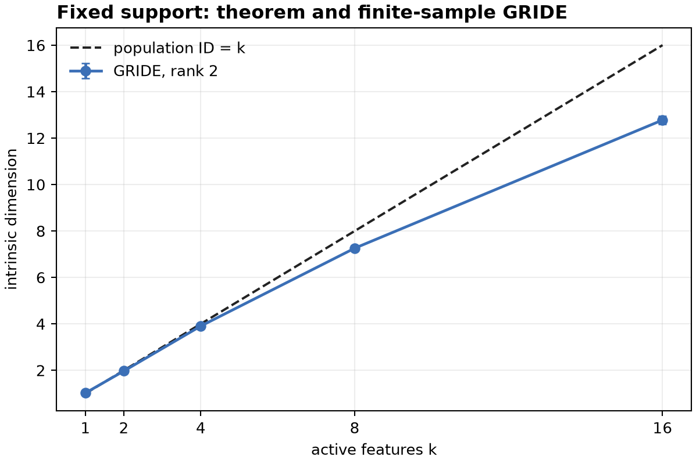
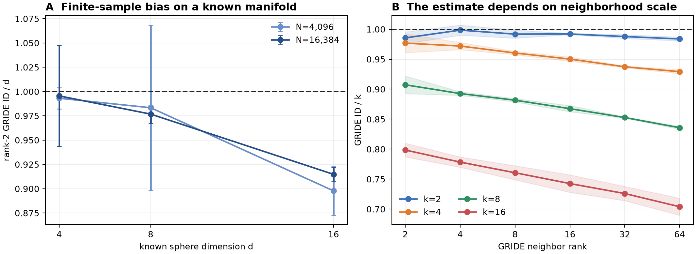
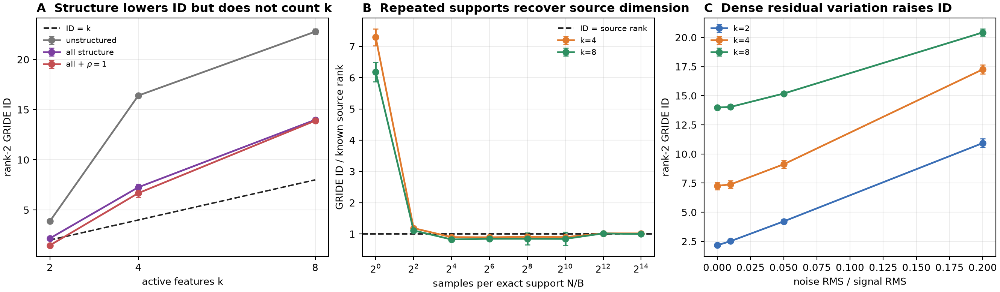

# Intrinsic dimension and active features

## The question

Suppose an activation is built from a sparse set of latent features. If exactly $k$ features are active, should its intrinsic dimension (ID) be close to $k$?

This matters because $k$ and ID describe the same representation from two viewpoints:

- $k$ is a latent, feature-level quantity;
- ID is a geometric quantity estimated directly from activation vectors.

If they agree under useful conditions, ID could reveal something about sparse feature use without first identifying every feature. But a correlation is not enough: $k$ may change several aspects of the geometry at once. We therefore separate three questions.

1. When is $mathrm{ID}=k$ mathematically true?
2. Does GRIDE recover that ID from finite data?
3. What remains after adding structure motivated by LLM representations?

The answer is compact:

> $mathrm{ID}=k$ is exact for one fixed, full-rank support with $k$ independent continuous amplitudes. GRIDE approximately recovers this in easy regimes, but its finite-scale estimate depends on dimension, neighborhood rank, support mixing, sampling density, geometry, and noise. In the structured model, ID still orders examples by $k$ extremely well, but it usually does not equal $k$.

## Common model

All experiments use an untrained sparse superposition model:

$$h=Wz,\qquad W\in\mathbb{R}^{D\times m},\qquad m>D.$$

$W$ contains $m$ feature directions in a $D$-dimensional representation space. The latent vector $z$ has exactly $k$ nonzero entries. We use GRIDE at neighbor ranks $2,4,8,16,32,64$ and retain the full profile rather than selecting one favorable scale.

# Part 1 — when ID really equals $k$

Fix one support $S$ of size $k$. Then

$$h=W_Sa,$$

where $a\in\mathbb{R}^k$ contains the active amplitudes. Assume:

1. every sample uses the same support $S$;
2. the amplitudes vary continuously and independently in an open region of $\mathbb{R}^k$;
3. $W_S$ has rank $k$, so necessarily $k\leq D$;
4. there is no additional full-dimensional noise.

The map $F(a)=W_Sa$ has constant Jacobian

$$J_F(a)=W_S.$$

Its Jacobian rank is $k$. Therefore $F$ maps a locally $k$-dimensional amplitude distribution injectively into a $k$-dimensional subspace of representation space. Hence

$$\mathrm{ID}(h)=k.$$

This is not a GRIDE theorem; it is a property of the population distribution. More generally, ID counts independent continuous directions, not nonzero coordinates. Shared amplitudes or a rank-deficient $W_S$ can make ID smaller than $k$.

The numerical check used $D=32$, $m=256$, one fixed support, five repeats, and up to $N=16{,}384$ samples. Rank-2 GRIDE gave

| $k$ | 1 | 2 | 4 | 8 | 16 |
| ---: | ---: | ---: | ---: | ---: | ---: |
| GRIDE ID | 1.02 | 1.97 | 3.91 | 7.26 | 12.78 |

It is well calibrated through $k=4$, reasonable at $k=8$, and biased downward at $k=16$.



# Part 2 — GRIDE is a finite-scale estimator, not an oracle

GRIDE estimates dimension from ratios of neighbor distances. A returned value therefore depends on which neighborhoods are resolved by the available sample.

Even on a boundaryless sphere with exactly known dimension, rank-2 GRIDE underestimated $d=16$: $widehat d/d=0.898$ at $N=4{,}096$ and $0.915$ at $N=16{,}384$. On the fixed-support model, increasing the neighbor rank progressively lowered the estimate for larger $k$. Thus an exact population statement does not imply exact finite-sample recovery.



The more important problem is support mixing. With varying supports, the pooled distribution is

$$p(h)=\sum_S p(S)\,p(h\mid S).$$

Each conditional component can have ID $k$, but a finite neighborhood may contain points from many components. GRIDE then measures the geometry of that local mixture, not only the continuous dimension within one support. Discrete support identity does not automatically add population differential dimension; it changes the finite-scale geometry when samples from the same support are too sparse or different support manifolds lie close together.

The practical consequences are:

- a high correlation between $k$ and GRIDE ID can survive because larger $k$ increases both continuous variation and the variety of nearby supports;
- numerical equality requires calibration, not only monotonicity;
- changing $N$ or GRIDE rank can change which support components enter a neighborhood;
- there may be no single scale-independent ID for a heterogeneous pooled representation.

For this reason, all later claims are made at fixed $k$, $N$, and GRIDE rank using paired random repeats.

# Part 3 — a more LLM-like structured model

We keep the model deliberately simple and untrained, but add five qualitative properties associated with LLM representations. The $m=256$ features are split into $G=8$ modules in $D=32$ dimensions.

For each sample, a context module $c$ is chosen and exactly $k$ features are sampled with weights

$$\log p_i(c)=-\alpha\log r_i+\beta\,\mathbf{1}[g(i)=c].$$

$\beta$ creates modular co-occurrence; $\alpha$ creates Zipf-like feature frequencies. Active amplitudes are

$$z_i=\exp\!\left(s\left(\sqrt{\rho}\,u_{g(i)}+\sqrt{1-\rho}\,\epsilon_i\right)-\frac{s^2}{2}\right).$$

$\rho$ controls shared variation inside a module. At $\rho<1$, the exact source rank remains $k$; at $\rho=1$, it becomes the number of active modules. Feature directions are

$$w_i=\operatorname{normalize}\!\left(\sqrt{1-\gamma}\,v_i+\sqrt{\gamma}\,c_{g(i)}\right),$$

so $\gamma$ creates coherent feature clusters. Finally, isotropic residual variation is added as

$$h_{\mathrm{obs}}=h+\sigma\,\operatorname{RMS}(h)\,\eta.$$

| property | why it is LLM-motivated | what it changes here |
| --- | --- | --- |
| $m>D$ | superposition | more candidate features than coordinates |
| modular supports | contextual co-occurrence | nearby samples share a topic but not necessarily a support |
| Zipf frequencies | common and rare features | local sampling density becomes unequal |
| shared amplitudes | common upstream factors | nonzero count can exceed continuous source rank |
| coherent directions | clustered learned features | finite-scale directions become harder to resolve |
| dense residual variation | unmodelled activation content | sufficiently small-scale population ID becomes $D$ |

These are analogies, not claims that the generator is an LLM.

## Main structured result

The combined structural condition uses $\beta=4$, $\alpha=1$, $\rho=0.9$, $\gamma=0.75$, and initially $\sigma=0$. At $N=16{,}384$ and GRIDE rank 2:

| condition | $k=2$ | $k=4$ | $k=8$ |
| --- | ---: | ---: | ---: |
| unstructured baseline | 3.87 | 16.40 | 22.77 |
| all structural conditions | 2.17 | 7.26 | 13.98 |
| all structure with exact shared amplitudes, $\rho=1$ | 1.47 | 6.68 | 13.89 |

All structural conditions lowered ID relative to the baseline in every one of the $3\times2\times6=36$ matched $(k,N,\text{rank})$ cells. All five repeats agreed in sign. At the same time, every repeat preserved the strict ordering

$$\widehat d(k=2)<\widehat d(k=4)<\widehat d(k=8).$$

Thus tracking is excellent, but calibration is not: for the combined model, rank-2 $widehat d/k$ is $1.09,1.82,1.75$.

## Targeted support-density check

We ran 96 additional measurements to test whether support mixing explains the mismatch. The structured model was held fixed while the exact support pool and samples per support were controlled. With $\rho=1$, the source rank is known exactly.

| condition | $k=4$: GRIDE/source | $k=8$: GRIDE/source |
| --- | ---: | ---: |
| one fixed support | 1.02 | 1.00 |
| one sample per support | 7.30 | 6.18 |
| four samples per support | 1.19 | 1.11 |

This directly supports the mechanism: GRIDE recovers the conditional source dimension when exact supports are locally represented, but a support-poor pooled sample can look many times higher-dimensional. Some exact rank-1, high-density cells produced DADApy zero-distance warnings and undefined internal error bars; the saved ID estimates remained finite and near the known rank, so we use only the rank-2 means for this check.

## Dense variation

Adding noise on top of all structural conditions moves GRIDE upward:

| noise ratio $\sigma$ | $k=2$ | $k=4$ | $k=8$ |
| ---: | ---: | ---: | ---: |
| 0 | 2.17 | 7.26 | 13.98 |
| 0.05 | 4.21 | 9.12 | 15.18 |
| 0.20 | 10.93 | 17.26 | 20.43 |

Any nonzero isotropic noise has formal infinitesimal dimension $D=32$. Finite GRIDE approaches that regime only when the noise is large enough relative to the resolved neighborhood scale.



# What the results mean

The project supports three levels of statement:

1. **Exact:** on one fixed full-rank support with independent amplitudes, population $mathrm{ID}=k$.
2. **Estimator-dependent:** GRIDE approximately recovers this only when dimension, sample density, and neighborhood scale are favorable.
3. **Structured pooled model:** GRIDE ID remains strongly ordered by $k$, but it reflects within-support variation, support diversity, geometry, frequency imbalance, and dense residual directions together.

The high $k$--ID correlation is therefore partly expected and not, by itself, evidence that GRIDE counts active features. The interesting empirical question is narrower:

> At a specified scale and sampling density, does GRIDE track the number and diversity of locally resolvable feature degrees of freedom?

That question is worth testing in learned models. A real-model study should report the full GRIDE profile, vary sample count, measure exact- or approximate-support overlap between neighbors, separate structured signal from residual noise, and compare examples at matched context and geometry. Without these controls, “ID is close to the number of active features” is too strong.

## Reproduction

The primary completed runs are Part 1 job `169169`, structured suites job `169194`, and structured support-pool job `169258`. The compact figures are regenerated with:

```bash
MPLCONFIGDIR=/tmp/id-features-matplotlib \
  .venv/bin/python scripts/plot_main_results.py \
  --pool-dir results/part3-support-pool-169258
```

Detailed designs and larger diagnostic tables remain in the other files under `docs/`, but this document contains the complete main argument.
